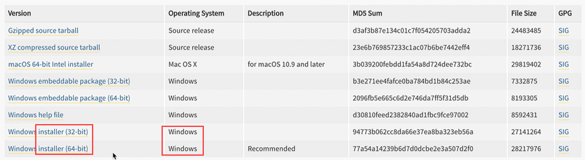
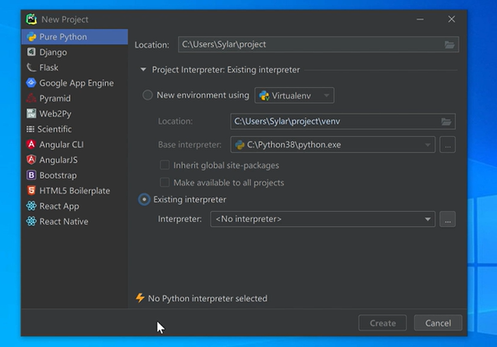

# python学习

官方网站：www.python.org

编程语言分类：

​	1.编译型：C，go

​		一次性把源代码进行翻译

​		特点：执行效率很高，平台依赖性一般比较高

​	2.解释型：javascript，python，ruby

​		逐行的对源代码进行翻译和运行

​		特点：执行效率相对较低，平台的依赖性不高

## 安装python解释器

python下载版本：

​	一般使用最新版的下一个版本进行学习和使用。

​	最新的不一定是最好的。

### 下载



下载时，根据电脑类型，下载相对应的安装版。

### 安装


安装时，注意勾选，将python添加到**path环境变量**中（否则，无法使用python命令）。

#### 如何更改python的安装目录

1.

勾选添加到path后选择下面的选项

2.以下选项不要动，均勾选即可。而后点击**next**到达下一安装界面。


3.


勾选`Install for all users`，以防切换用户后，避免python无法使用的情况，其他选项不用动，而后进行修改位置。

<font color=red>注意：在设置路径时，不要包含中文字符！！</font>

4.看到`Setup was successful`后，便可关闭该安装程序，python安装完成。

### 检查安装是否成功

通过电脑内的搜索，打开命令提示符，输入`python`后，弹出Python相关信息，即安装成功。

若出现`不是内部活外部命令，也不是可运行的程序`，可能会是因为没有勾选**添加到path环境变量**。

#### 解决方法

1.右键点击此电脑，点击属性=>高级系统设置=>环境变量=>在系统变量中找到path，双击后，填写自己python安装位置的两个路径（python根目录和python的Scrips文件夹）


## 第一个python程序的开发

打开命令提示符，输入python进入python环境，输入以下代码

```python
print("hello world") #注意一定要为英文状态
```

即可运行为`hello world`

### 对代码进行保存和运行

1.显示文件后缀名

随便打开一个文件夹，勾选文件扩展名。


2.新建文本文档（txt），此时，文本文档的名称应为**新建文本文档.txt**

修改后缀为.py（python文件后缀名为py）

3.右键点击**编辑**，即可编写代码。

编写好后，注意保存，快捷ctrl+s

4.运行py文件

<font color=red>注意，在命令提示符中，如果已经在python运行环境里面，只需要**拖动文件夹到命令提示符窗口**即可，无需在文件名前面添加python字符，如果未提前输入`python`进入到python运行环境中，需要输入`python 文件位置/文件名`来运行</font>

### python在命令提示符运行指令

`python 文件位置/文件名`

## python编写软件

1.记事本

2.vscode

3.pycharm

4.notebook

### pycharm安装

在浏览器中搜索pycharm，下载好pycharm后，进行安装，<font color=red>不需要勾选添加到path</font>



选择Existing interpreter后引索到python解释器的位置即python.exe文件

# 注释

对代码进行解释和说明，机器不运行

```python
# 单行注释

"""
多行注释
"""

'''
多行注释
'''
```

pycharm自动保存，文件名有`*`不用理

